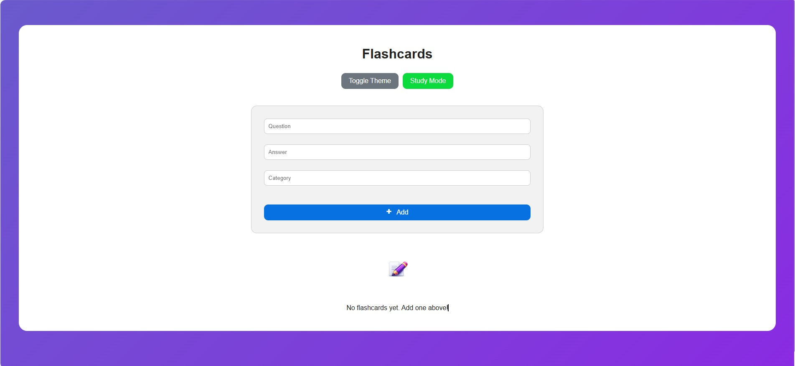
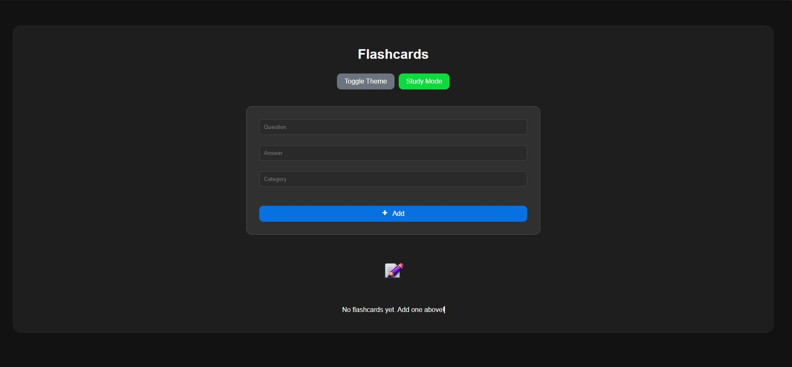
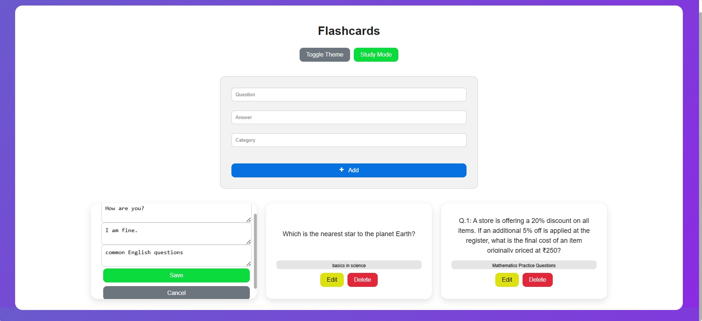
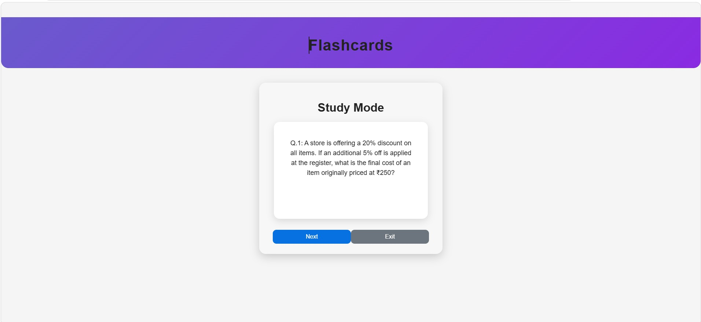

README.md 

FLASHCARD LEARNING APP

Single-Page Dynamic Web Interface with Full CRUD, MongoDB Storage & Interactive Study Mode

⭐ 1. Project Overview

The Flashcard Learning App is an interactive learning tool designed to help users memorise and analyse information using digital flashcards. Each card has a question, answer, and card type, letting users organise their study materials. The system works as a proper Single-Page Application (SPA): all interactions—creating, editing, deleting, adapting cards, switching topics, and entering Study Mode—happen without the page reloading.

All flashcards are stored in a MongoDB database, making sure that all the data stays intact across sessions. The project shows off a full setup, mixing the React frontend with a backend using Express.js and a MongoDB/Mongoose database to give a top-notch, responsive, and modern learning experience.

🧰 2. Technology Stack Overview

This project is developed using a modern JavaScript full-stack framework.

The frontend uses parts of the React function and hooks like useState and useEffect to manage the status and behaviour of the SPA. Conditional rendering is used to switch between standard mode and Study Mode. Axios handles all API interactions, while CSS takes care of styling, animations, transitions, and responsive layouts. The functions/flashcardService.js file keeps all requests to the backend clean and well-maintained.

The backend is constructed using Express.js, providing a REST API that supports the complete range of CRUD operations. CORS is enabled to facilitate communication with the React frontend, and express.json() is employed to parse the bodies of JSON requests.

MongoDB keeps all the flashcards stored all the time. The Mongoose schema lays out what each flashcard should look like, covering where the question, answer, type, and timestamps go. This makes sure the data keeps running smoothly and the database works reliably.

Together, these technologies make a clean and modular setup where the React interface talks to the Express backend, which then chats with MongoDB to store and fetch flashcard data.

🖼️ 3. UI Preview

HOME SCREEN LIGHT MODE

HOME SCREEN DARK MODE

EDIT MODE

STUDY MODE

🚀 4. Key Features

The Flashcard Learning App packs in a bunch of handy features. You can make flashcards by popping in a question, answer, and category. All the flashcards show up in a neat grid layout. Each card can be clicked to flip between the question and answer with a slick high-res 3D rotation. You can also edit cards right there or delete them with a fade-out effect.

Study Mode offers a simple interface for focus analysis. When it starts, the system picks a flashcard from the current deck and shows it. You can tap the card to flip it, revealing the answer with the same 3D flip animation as in normal mode. Every time a card comes up in Study Mode, it’s taken out of the active deck, so you won’t see the same card again during the session. After adjusting and checking the answer, the user can click 'Next' to load a random card from the rest of the deck. This continues until there are no more cards. Without any cards left in the deck, Study Mode can't go on. The full flash card is only brought back when the user creates a new card, which starts reloading all the flashcards from the database.

The app distinguishes flashcards that have already been viewed in Study Mode. When a card is displayed during a training session, it is marked as "used" in the database and shown in a dark format when it returns to normal. This allows users to easily identify which cards have been studied and which have not been checked.

The feature comes with a Light/Dark theme switch, smooth animations, and a fully mobile-responsive layout. Improvements for accessibility like keyboard focus and navigation make sure the user experience is great. Everything happens without page reloads, keeping the quality that an SPA needs.

Features: 

- Create, edit and delete flashcards 
- 3D flip animation 
- Study mode with randomised cards 
- Card icon shown after study mode (greyed out once viewed) 
- Light/dark theme toggle 
- Full response layout 
- Single page app (no reloads)

📁 5. Folder Layout

The project is split into three main directories, 

Keeping the backend logic, frontend UI, and database export separate. 

This setup makes it easy to see the difference between the frontend, backend, and data layers, and keeps things simple to maintain and expand.

flashcard-app/
│
├── backend/
│   ├── server.js
│   ├── package.json
│   ├── package-lock.json
│   └── node_modules/
│
├── frontend/
│   ├── public/
│   │   ├── index.html
│   │   ├── favicon.ico
│   │   ├── favicon.png
│   │   ├── logo192.png
│   │   ├── logo512.png
│   │   ├── manifest.json
│   │   ├── robots.txt
│   │   └── pen.png
│   │
│   ├── src/
│   │   ├── assets/
│   │   │   ├── homescreen.jpg
│   │   │   ├── dark-mode.jpg
│   │   │   ├── edit-mode.jpg
│   │   │   ├── studymode.jpg
│   │   │   └── pen.png
│   │   │
│   │   ├── components/
│   │   │   ├── AddForm.js
│   │   │   └── Flashcard.js
│   │   │
│   │   ├── services/
│   │   │   └── flashcardService.js
│   │   │
│   │   ├── App.js
│   │   ├── App.css
│   │   ├── index.js
│   │   ├── index.css
│   │   ├── logo.svg
│   │   ├── reportWebVitals.js
│   │   └── setupTests.js
│   │
│   ├── package.json
│   └── package-lock.json
│
├── database/
│   └── flashcards_export.json
│
└── README.md

This framework neatly separates the backend server, React frontend, and database export, making for a modular, easy-to-maintain and scalable full-stack app.

🏃‍♂️ 6. How to go about processing the application

To run the backend, open a terminal and go to the backend folder. Install the dependencies with npm install, make sure MongoDB is running locally, and start the backend server with npm start. The backend will run on http://localhost:5000.

To run the frontend, open another terminal and head to the frontend folder. Install the dependencies with npm install and start the React development server using npm start. The frontend will run on http://localhost:3000. Once both servers are up and running, the system is good to go.

🌐 7. Deployment Overview

The system runs locally using the React development server on port 3000 and the Express backend on port 5000. MongoDB also runs locally. If you use it in the future, recommended services are Vercel or Netlify for the frontend, Render or Railway for the backend, and MongoDB Atlas for the database.

🗄️ 8. Export of Database

To simulate stable data, you can export the MongoDB collection using MongoDB Compass. The exported JSON file is in the database/flashcards_export.json entry.

🧩 9. Overcoming challenges

We sorted out quite a few challenges during development, like making sure CRUD worked fully with MongoDB and Mongoose, handling async API calls between React and Express, fixing CORS problems, and keeping the SPA behaviour through state management. Other bits we tackled were adding card animations, boosting accessibility, stopping UI glitches when editing or deleting, and keeping the API definition in a single storage file.

🔮 10. Future Enhancements

Improvements that could be made include using a spaced-repetition study algorithm, adding a shuffle mode and progress tracking, introducing the user to individual decks, expanding Study Mode with scores and timers, moving the database to the cloud, and adding category filtering and search functionality.

👤 11. Developer

Developed by Alfred David Teaupa — 11502770 
University of Technology Sydney 
Assignment 1 — Dynamic Web Interface to a Database System